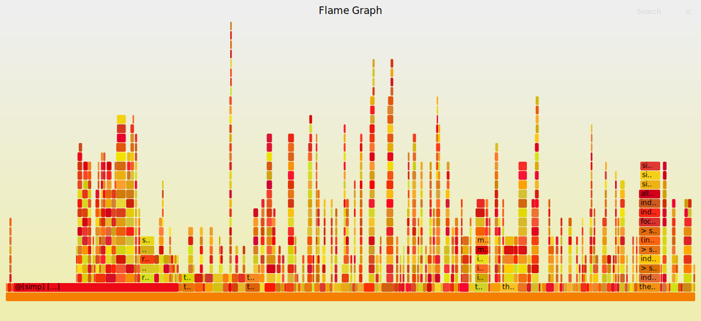

# LeanFlame
View your Lean 4 compiler trace as a flamegraph.

## How does it work
You compile the tool using `lake build`, then you run it like so:
```
$ cat trace.txt | ./build/bin/flame > out.txt
```
where `trace.txt` is output from your Lean infoview with the options:
```lean
set_option trace.profiler true
set_option pp.oneline true
```
enabled either just in some block of your code or the entire file.
Alternatively you can also run:
```
$ lake env lean -D trace.profiler=true -D pp.oneline=true file.lean > trace.txt
```
or also directly!
```
$ lake env lean -D trace.profiler=true -D pp.oneline=true file.lean | /path/to/flame > out.txt
```
To obtain a trace for an entire file without editing it.
You can also concatenate multiple traces into one big file if you desire:
```
$ cat trace1.txt trace2.txt > trace.txt
```
LeanFlame will print its output in the [collapsed stack format](https://github.com/BrendanGregg/flamegraph#2-fold-stacks)
you can use them with for example the `flamegraph.pl` script from the original
flamegraph implementation repository or use an online viewer like
[speedscope](https://www.speedscope.app).
## Example
This example shows how to obtain a trace from the file with (currently) the most lines in
`std4`:
```
$ lake env lean -D trace.profiler=true -D pp.oneline=true Std/Data/List/Lemmas.lean | ../flame/build/bin/flame > trace.txt
$ wc -l trace.txt
1007 trace.txt
$ flamegraph.pl trace.txt > test.svg
```
Resulting in 
