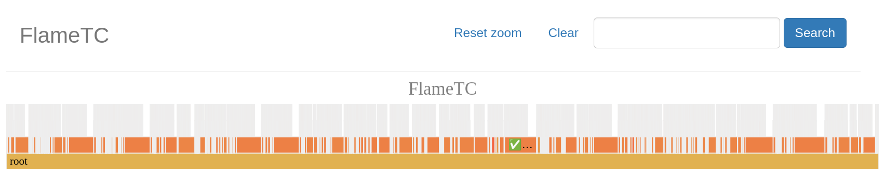
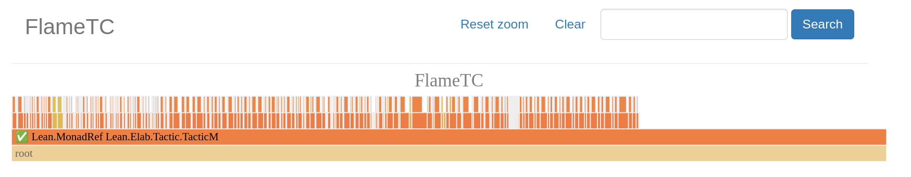
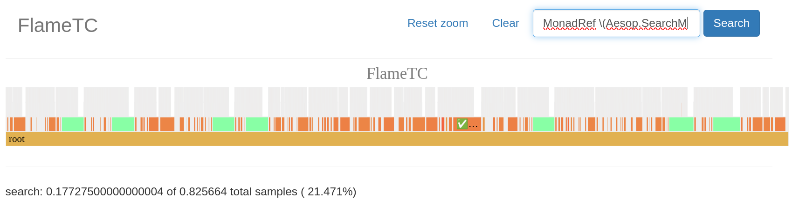
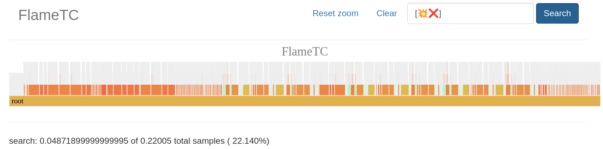

# FlameTC
View your Lean 4 typeclass synthesis trace as a flamegraph in your browser.

## How does it work
You compile the tool using `lake build`, then you run it like so:
```
$ ./build/bin/flametc trace.txt
```
where `trace.txt` is output from your Lean infoview with the options:
```lean
set_option profiler true
set_option trace.Meta.synthInstance true
```
enabled either just in some block of your code or the entire file.
Alternatively you can also run:
```
$ lake env lean -D profiler=true -D trace.Meta.synthInstance=true file.lean > trace.txt
```
To obtain a trace for an entire file without editing it. Note that this assumes
your file is not outputting anything else in the info view while getting
compiled. You can also concatenate multiple traces into one big file if you desire:
```
$ cat trace1.txt trace2.txt > trace.txt
```

FlameTC will store its output in `./build/flametc` consisting of two files, `data.json`
and `index.html`, you need to host it locally with for example pythons buit-in
webserver:
```
$ python3 -m http.server
```
afterwards you can visit [http://0.0.0.0:8000](http://0.0.0.0:8000) to view your
result. For big searches the graph will usually look a little convoluted but
it can still be useful as explained in the next section.

## How to use it
While I am by no means an expert on performance analysis of Lean's type class
synthesis here are a few "primitives" that might be interesting for analysis:
### Zooming in on subqueries


### Filtering for names
You can filter using regex for:
- names of typeclasses: `MonadRef`
- names of types: `MyMonad`
- or also whole queries: `MonadRef \(MyMonad` (The backslash is for regex)

### Filtering for succeeding or failing queries
You can filter for succeeding or failing queries by looking for the unicode
symbols associated with them in the info view like ❌, 💥 and ✅.
This is for example useful if you want to know whether lots of failures
in TC synthesis are slowing things down (also combinable with regex as seen below):

